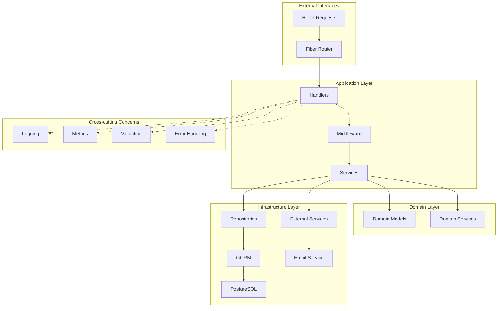

# User Management API: Implementation Plan

This document outlines a comprehensive three-phase implementation plan for building a full-fledged user management API in Go. The project will demonstrate a clean, scalable architecture and modern development practices using the chosen tech stack: **Go, Fiber, GORM, Hexagonal Architecture, and manual migrations.**

## Architecture Overview



---

## Phase 1: Minimum Viable Product (MVP)

The goal of this phase is to build the core functionality of the API, focusing on the essential user lifecycle from registration to profile management.

### Step 1: Project Foundation & Architecture

Establish the project structure and core components based on Hexagonal Architecture principles.

- **Acceptance Criteria:**
  - The project follows a clean directory structure (e.g., `cmd`, `internal`, `migrations`).
  - The `internal` directory is organized by layers (e.g., `domain`, `service`, `handler`, `repository`).
  - A basic Fiber web server is implemented and can start successfully.
  - Configuration management (e.g., using Viper) is set up to load values from environment variables or a config file.

### Step 2: Database & Migrations Setup

Implement the persistence layer using GORM and establish a robust migration strategy.

- **Acceptance Criteria:**
  - A connection to a PostgreSQL (or other chosen) database is successfully established using GORM with connection pooling configuration.
  - The `golang-migrate` tool is integrated into the project.
  - An initial migration file is created to build the `users` table with columns for `id`, `email`, `password_hash`, `status`, `last_login_at`, `deleted_at`, `created_at`, and `updated_at`.
  - The migration can be successfully applied (`up`) and rolled back (`down`) from the command line.
  - Database transaction management is implemented for data consistency.

### Step 3: Core User Authentication

Implement the fundamental authentication endpoints: registration and login.

- **Acceptance Criteria:**

  - `POST /api/v1/register` endpoint exists.
    - Accepts `email` and `password` in the request body.
    - Validates input using `go-playground/validator` with rules: email format, password min 8 chars with uppercase, lowercase, number, and special character.
    - Hashes passwords using `bcrypt` with cost factor 12 before storage.
    - Returns a `201 Created` status on success and a `409 Conflict` if the user already exists.
  - `POST /api/v1/login` endpoint exists.
    - Accepts `email` and `password`.
    - Verifies credentials against the stored hash.
    - On success, returns a short-lived JSON Web Token (JWT) with 15-minute expiration.
    - Returns a `401 Unauthorized` status on invalid credentials.
  - Standardized error response format is implemented:

    ```json
    {
      "error": {
        "code": "VALIDATION_ERROR",
        "message": "Invalid input",
        "details": [{ "field": "email", "message": "Invalid email format" }]
      }
    }
    ```

### Step 3.5: Input Validation & Error Handling Framework

Implement a comprehensive validation and error handling system for consistent API responses.

- **Acceptance Criteria:**
  - A validation middleware is created using `go-playground/validator`.
  - Custom validation rules are defined for common fields (email, password, UUIDs).
  - A centralized error handler is implemented to format all errors consistently.
  - Request sanitization is implemented to prevent injection attacks.
  - All endpoints return consistent error responses with appropriate HTTP status codes.

### Step 4: User Profile Management

Create protected endpoints that allow a logged-in user to manage their own profile.

- **Acceptance Criteria:**
  - Authentication middleware is created to validate JWTs from the `Authorization` header and identify the user.
  - `GET /api/v1/users/me` endpoint exists.
    - Is protected by the authentication middleware.
    - Returns the profile information for the currently authenticated user.
  - `PUT /api/v1/users/me` endpoint exists.
    - Is protected by the authentication middleware.
    - Allows the user to update their profile information (e.g., email).
    - Returns the updated user profile on success.
  - `DELETE /api/v1/users/me` endpoint exists.
    - Is protected by the authentication middleware.
    - Implements soft delete by setting the `deleted_at` timestamp (user data is retained for audit and compliance purposes).
    - Returns a confirmation message indicating the account has been deactivated.

### Step 4.5: Basic Unit Testing

Implement essential tests for core business logic to ensure reliability.

- **Acceptance Criteria:**
  - Unit tests are written for user registration logic.
  - Unit tests are written for password hashing and verification.
  - Unit tests are written for JWT token generation and validation.
  - Test coverage is at least 80% for domain and service layers.
  - Tests are organized in a `tests` directory following Go conventions.

---

## Phase 2: Production Ready

The goal of this phase is to enhance the API with advanced security features, granular access control, and the operational tooling expected of a modern, production-grade application.

### Step 5: Advanced Security Features

Implement critical security flows to improve user safety and experience.

- **Acceptance Criteria:**
  - **Refresh Token Flow:** The login endpoint now provides both an access token (short-lived) and a refresh token (long-lived, stored in an HttpOnly cookie). A new endpoint, `POST /api/v1/refresh`, uses the refresh token to issue new access tokens.
  - **Email Verification:** New users are created in an "unverified" state. A mechanism exists to send a verification email (can be logged to console locally). A `GET /api/v1/verify/{token}` endpoint successfully verifies a user's account.
  - **Forgot Password Flow:** A `POST /api/v1/password/forgot` endpoint generates a secure, time-limited reset token for a given email. A `POST /api/v1/password/reset` endpoint allows a user to change their password using this token.

### Step 6: Role-Based Access Control (RBAC) & Permissions

Introduce a flexible authorization system that goes beyond simple user roles.

- **Acceptance Criteria:**
  - Database schema is updated with `roles`, `permissions`, and their respective join tables.
  - A user can be assigned one or more roles.
  - A role can be assigned one or more permissions (e.g., `user:read`, `user:delete`).
  - A new middleware is created that checks for a specific permission (e.g., `RequiredPermission("user:delete")`) rather than just a role.
  - User permissions are efficiently loaded and cached (e.g., embedded in the JWT) for performant authorization checks.

### Step 7: Administrative Endpoints

Build a dedicated set of endpoints for administrators to manage the application's users and roles.

- **Acceptance Criteria:**
  - All admin endpoints are protected by the `RequiredPermission` middleware.
  - `GET /api/v1/admin/users` endpoint exists, listing all users with pagination.
  - `GET /api/v1/admin/users/{id}` endpoint exists, retrieving a specific user's details.
  - `PUT /api/v1/admin/users/{id}` endpoint exists, allowing an admin to modify a user's details, including their assigned roles.
  - `DELETE /api/v1/admin/users/{id}` endpoint exists, allowing an admin to soft delete a user.
    - Sets the `deleted_at` timestamp and deactivates the user account.
    - User data is retained for audit and compliance purposes.
  - `GET /api/v1/admin/users/deleted` endpoint exists, listing soft-deleted users for administrative review.
  - `POST /api/v1/admin/users/{id}/restore` endpoint exists, allowing an admin to restore a soft-deleted user account.

### Step 8: Security Hardening

Implement critical security measures to protect the API from common threats.

- **Acceptance Criteria:**
  - **Rate Limiting:** Token bucket algorithm implemented using Redis to prevent abuse (100 requests per minute per IP).
  - **CORS Configuration:** Proper CORS policy configured for cross-origin requests.
  - **Security Headers:** OWASP-recommended security headers implemented (CSP, HSTS, X-Frame-Options, etc.).
  - **Request/Response Logging:** Comprehensive logging for security auditing and debugging.
  - **Input Sanitization:** All user inputs are sanitized to prevent injection attacks.

### Step 8.5: Observability & Monitoring

Implement monitoring and health check capabilities for production operations.

- **Acceptance Criteria:**
  - **Health Check Endpoints:** `/health` and `/ready` endpoints for load balancers and monitoring systems.
  - **Metrics Collection:** Prometheus client library integrated with standard Go collectors and custom application metrics.
  - **Structured Logging:** The application uses `zap` for high-performance structured logging in JSON format.
  - **Request Tracing:** Request IDs generated and logged for tracing requests through the system.
  - **Performance Monitoring:** Response times and error rates tracked for critical endpoints.

### Step 9: Performance Optimization

Optimize the application for better performance and resource utilization.

- **Acceptance Criteria:**
  - **Database Connection Pooling:** Optimized connection pool configuration for the database.
  - **Caching Strategy:** Redis integration for caching frequently accessed data (user permissions, sessions).
  - **Background Job Processing:** Job queue implementation for asynchronous tasks (email sending).
  - **Response Compression:** Gzip compression enabled for API responses.
  - **Pagination:** List endpoints implement proper pagination with limit/offset.

### Step 10: Operational Excellence & Tooling

Add the final layer of professionalism with documentation, containerization, and testing.

- **Acceptance Criteria:**
  - **API Documentation:** Interactive Swagger/OpenAPI documentation is automatically generated (e.g., using `swaggo`) and is available via a route on the API server.
  - **Containerization:** A multi-stage `Dockerfile` is created to build an optimized container image for the API. A `docker-compose.yml` file is created to orchestrate the API and its dependencies.
  - **Graceful Shutdown:** The application gracefully shuts down, finishing in-flight requests and closing database connections when it receives a shutdown signal (e.g., SIGINT).
  - **Testing:** Unit tests are written for business logic, and integration tests are written for key API endpoints to ensure the system works as expected.
  - **Environment Configuration:** Support for multiple environments (dev, staging, prod) with environment-specific configurations.

---

## Phase 3: Development Workflow & Deployment

The goal of this phase is to establish a professional development workflow with automated testing, continuous integration, and deployment processes.

### Step 11: Development Workflow Setup

Establish tools and processes for efficient local development.

- **Acceptance Criteria:**
  - **Pre-commit Hooks:** Configured using `husky` or `pre-commit` to run linting, formatting, and tests before commits.
  - **Local Development Environment:** Docker Compose configuration for spinning up the entire stack (API, database, Redis) locally.
  - **Database Seeding:** Scripts to populate the database with initial data for development and testing.
  - **Code Quality Tools:** `golangci-lint` configured for comprehensive code analysis.
  - **Documentation Standards:** Guidelines for code documentation and API documentation updates.

### Step 12: Continuous Integration & Deployment (CI/CD)

Implement automated pipelines for testing and deployment.

- **Acceptance Criteria:**
  - **GitHub Actions Workflow:** Automated pipeline that runs on every push and pull request.
  - **Automated Testing:** Pipeline runs unit tests, integration tests, and generates coverage reports.
  - **Security Scanning:** Automated vulnerability scanning for dependencies and code.
  - **Container Registry:** Automated building and pushing of Docker images to a registry.
  - **Deployment Automation:** Automated deployment to staging and production environments with proper approvals.
  - **Rollback Strategy:** Automated rollback mechanism for failed deployments.

### Step 13: Monitoring & Alerting in Production

Set up comprehensive monitoring and alerting for the production environment.

- **Acceptance Criteria:**
  - **Prometheus/Grafana Setup:** Monitoring dashboard with key metrics (response times, error rates, resource usage).
  - **Alerting Rules:** Configured alerts for critical issues (high error rates, service downtime).
  - **Log Aggregation:** Centralized logging with ELK stack or similar solution.
  - **Error Tracking:** Integration with error tracking service (e.g., Sentry).
  - **Uptime Monitoring:** External monitoring of API endpoints with alerting.

---

## Technical Specifications

### Error Response Format

All API errors follow this consistent format:

```json
{
  "error": {
    "code": "ERROR_CODE",
    "message": "Human-readable error message",
    "details": [{ "field": "field_name", "message": "Specific error detail" }]
  }
}
```

### Validation Rules

- **Email:** Valid email format using regex
- **Password:** Minimum 8 characters, at least one uppercase, one lowercase, one number, one special character
- **UUID:** Standard UUID v4 format for IDs

### Rate Limiting

- Token bucket algorithm with Redis backend
- Default: 100 requests per minute per IP address
- Authentication endpoints: 5 requests per minute per IP address

### JWT Configuration

- Access Token: 15-minute expiration
- Refresh Token: 7-day expiration (HttpOnly cookie)
- Algorithm: RS256 with asymmetric keys

### Database Connection Pool

- Max Open Connections: 25
- Max Idle Connections: 5
- Connection Max Lifetime: 5 minutes

### Data Deletion Policy

This implementation uses **soft deletes** for user accounts:

- When a user is deleted, the `deleted_at` timestamp is set instead of removing the record
- This approach provides several benefits:
  - **Audit Trail**: Maintains historical data for compliance and auditing
  - **Data Recovery**: Allows restoration of accidentally deleted accounts
  - **Referential Integrity**: Prevents issues with related data (orders, logs, etc.)
  - **Analytics**: Preserves data for business intelligence and analysis
- Hard deletion can be implemented later as a separate administrative function with proper authorization

---

## Future Enhancements (Post-Phase 2)

### OAuth 2.0 Integration

After completing Phase 2, consider adding OAuth support for third-party authentication:

- **Database Schema Addition:** Create `user_auth_providers` table to store OAuth provider information
- **Google OAuth 2.0:** Allow users to sign in with their Google accounts
- **GitHub OAuth:** Add support for GitHub authentication
- **Provider Management:** Enable users to link/unlink OAuth providers to their existing accounts
- **Account Merging:** Handle cases where users try to sign in with OAuth using an email that already exists
- **Security Considerations:** Implement proper state parameter handling to prevent CSRF attacks

This approach allows the application to start with a solid foundation of traditional authentication and add OAuth capabilities once the core system is stable and production-ready.
